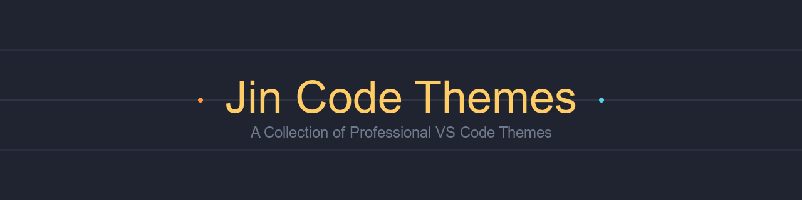
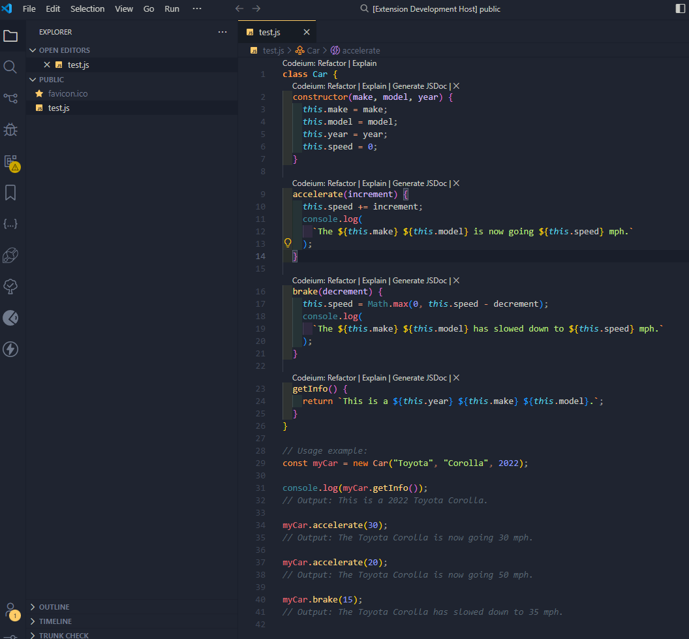

# Jin Theme Collection for VS Code

A sophisticated collection of carefully crafted Visual Studio Code themes with integrated cursor effects and optimized coding experience.



## 🎨 Available Themes

### J Charcoal (Dark)
A professional dark theme with carefully selected colors for optimal readability and reduced eye strain.
- Perfect for long coding sessions
- Optimized contrast ratios
- Sophisticated syntax highlighting
- Professional cursor animations



### J Dark Material v2
A modern take on material design with enhanced readability and clean aesthetics.
- Material design inspired
- Rich syntax highlighting
- Optimized for multiple languages
- Smooth cursor transitions


### J Charcoal Light
A clean, light theme for bright environments with perfect contrast and readability.
- Optimized for daylight conditions
- High contrast without eye strain
- Professional syntax highlighting
- Crisp cursor animations


### J Funky Minimal Dark
A fun, minimalist dark theme with unique cursor effects and playful accents.
- Vibrant accent colors
- Particle effects while typing
- Funky cursor animations
- Clean, distraction-free base


## ⚡ Features

### 🎯 Smart Cursor Effects
Each theme comes with its own carefully designed cursor behavior:

- **J Charcoal**
  - Solid line cursor
  - Smooth caret animation
  - Professional feel
  ```json
  {
    "editor.cursorStyle": "line",
    "editor.cursorBlinking": "solid",
    "editor.cursorSmoothCaretAnimation": true
  }
  ```

- **J Dark Material v2**
  - Block cursor
  - Smooth blinking
  - Modern aesthetics
  ```json
  {
    "editor.cursorStyle": "block",
    "editor.cursorBlinking": "smooth"
  }
  ```

- **J Charcoal Light**
  - Phase animation
  - Enhanced visibility
  - Clean transitions
  ```json
  {
    "editor.cursorStyle": "line",
    "editor.cursorBlinking": "phase"
  }
  ```

- **J Funky Minimal Dark**
  - Particle effects
  - Typing animations
  - Playful interactions
  ```json
  {
    "editor.cursorStyle": "block",
    "editor.cursorBlinking": "phase",
    "powerMode.enabled": true
  }
  ```

### 🎮 Language Support
Optimized syntax highlighting for:
- JavaScript/TypeScript
- Python
- Java
- C/C++
- HTML/CSS
- React/Vue
- Markdown
- And many more!

## 📦 Installation

1. Open VS Code
2. Go to Extensions (Ctrl+Shift+X)
3. Search for "Jin Themes"
4. Click Install
5. Select your preferred theme:
   - `Ctrl/Cmd + K + T`
   - Search for "J Charcoal" or other Jin themes

## 🛠 Recommended Settings

```json
{
    "editor.fontFamily": "JetBrains Mono, Fira Code, Consolas, 'Courier New', monospace",
    "editor.fontSize": 14,
    "editor.lineHeight": 1.5,
    "editor.fontLigatures": true,
    "editor.bracketPairColorization.enabled": true,
    "editor.guides.bracketPairs": true,
    "editor.smoothScrolling": true,
    "editor.cursorSmoothCaretAnimation": true
}
```

## ⚙️ Customization

### Cursor Effects
You can customize cursor effects in your `settings.json`:

```json
{
    "jinThemes.cursorEffects": {
        "currentTheme": {
            "cursorStyle": "block|line|underline",
            "cursorBlinking": "blink|smooth|phase|expand|solid",
            "powerMode.enabled": true|false
        }
    }
}
```

### Color Overrides
Customize specific colors in your `settings.json`:

```json
{
    "workbench.colorCustomizations": {
        "[J Charcoal]": {
            "editor.background": "#1E1E1E",
            "editor.foreground": "#CCCCCC"
        }
    }
}
```

## 🤝 Contributing

1. Fork the repository
2. Create your feature branch
   ```bash
   git checkout -b feature/AmazingFeature
   ```
3. Commit your changes
   ```bash
   git commit -m 'Add some AmazingFeature'
   ```
4. Push to the branch
   ```bash
   git push origin feature/AmazingFeature
   ```
5. Open a Pull Request

## 📝 License

Distributed under the MIT License. See `LICENSE` for more information.

## 🙏 Acknowledgments

- [VS Code Theme Documentation](https://code.visualstudio.com/api/references/theme-color)
- Power Mode extension integration
- Font recommendations from the community
---

Made with ❤️ by Jijin